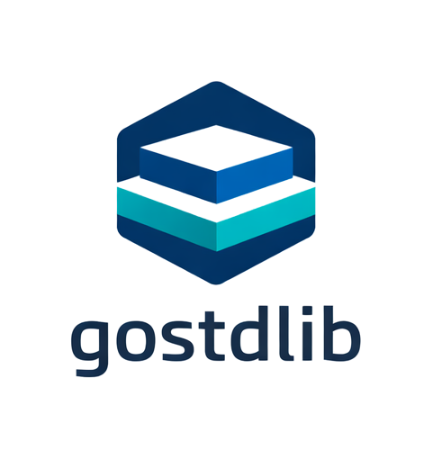

<p align="center">
  
</p>

# Base - Your Foundational Packages

[](https://pkg.go.dev/github.com/gostdlib/base)
[](https://goreportcard.com/report/github.com/gostdlib/base)

Since you've made it this far, why don't you hit that :star: up in the right corner.

Note: These packages are going through their paces, so some changes may occur.

## Introduction

This is a set of foundational packages for building Go services. These packages provide:

- **Structured Errors** - Automatic file/line capture, OTEL trace integration, metrics, and smart logging
- **Unified Context** - Single context carrying logger, metrics, worker pool, and background tasks
- **Worker Pools** - Goroutine reuse with metrics, limited pools, and safe group primitives
- **Background Tasks** - Tracked background goroutines with automatic restart and metrics
- **Telemetry** - Integrated logging, OTEL metrics, and distributed tracing
- **Concurrency Primitives** - Type-safe `sync.Pool`, sharded maps, fan-out/fan-in patterns

The philosophy is simple: **logs are for errors, traces are for debugging, metrics are for counting**.

## Quick Start

### 1. Install the Project Generator

```bash
go install github.com/gostdlib/base/genproject@latest
```

### 2. Initialize Your Project

In the root of your Go project:

```bash
genproject
```

This creates:
- `context/` - Custom context package wrapping `base/context` and stdlib
- `errors/` - Custom errors package with your own Category and Type enums
- `main.go` - Scaffolded service initialization

The `context/` and `errors/` packages are type compatible with the standard library and include the standard library calls and types to avoid having to import multiple packages.

### 3. Initialize Your Service

```go
package main

import (
    "myservice/context"
    goinit "github.com/gostdlib/base/init"
)

func main() {
    args := goinit.InitArgs{
        Meta: goinit.Meta{
            Service: "my-service",
            Build:   "1.0.0",
        },
    }
    goinit.Service(args)
    defer goinit.Close(args)

    ctx := context.Background()
    // Your service code here...
}
```

`init.Service()` automatically sets up:
- Structured logging with `slog`
- Worker pool for goroutine reuse
- Background task tracking
- GOMAXPROCS based on actual CPUs
- GOMEMLIMIT from container limits (Linux)

Signal handling (SIGTERM, SIGINT), tracing options and other things can be setup through init options.

## The Power of Unified Context

After calling `context.Background()`, you have access to a myriad of tools:

```go
ctx := context.Background()

// Access the logger
context.Log(ctx).Info("service started")

// Access the worker pool
context.Pool(ctx).Submit(ctx, func() {
    // Work done in reused goroutine
})

// Access metrics
counter, _ := context.Meter(ctx).Int64Counter("requests_total")
counter.Add(ctx, 1)

// Access background tasks
context.Tasks(ctx).Once(ctx, "cleanup", func(ctx context.Context) error {
    // One-shot background work
    return nil
})

// Create a trace span
ctx, span := context.NewSpan(ctx)
defer span.End()
```

Each of these tie together to deliver telemetry via OTEL with package paths and other runtime information.

## Structured Errors That Work For You

The errors package is designed around a simple principle: **errors are only logged at the service boundary**.

While we know this isn't 100% true, in most cases we can simply emit an error once and avoid error wrapping to simply log where the error actually occurred. If we need to know the stack trace we can simply record that via an option. This eliminates a lot of duplicate log messages that just make needle in the haystack problems.

### Defining Your Error Types

In your generated `errors/` package:

```go
//go:generate stringer -type=Category -linecomment

type Category uint32

const (
    CatUnknown   Category = 0 // Unknown
    CatInternal  Category = 1 // Internal
    CatClient    Category = 2 // Client
    CatUpstream  Category = 3 // Upstream
)

//go:generate stringer -type=Type -linecomment

type Type uint16

const (
    TypeUnknown    Type = 0 // Unknown
    TypeValidation Type = 1 // Validation
    TypeNotFound   Type = 2 // NotFound
    TypeTimeout    Type = 3 // Timeout
)
```

If you are not interested in `Category` and `Type` for your projects, you can elimminate them from the `E()` function and pass nil values to the underlying call, which will eliminate them from any log/trace output.

### Creating Errors

```go
func GetUser(ctx context.Context, id string) (*User, error) {
    user, err := db.FindUser(ctx, id)
    if err != nil {
        // Automatically captures file:line, adds to trace, increments metrics.
        return nil, errors.E(ctx, errors.CatInternal, errors.TypeNotFound, fmt.Errorf("user %s not found: %w", id, err))
    }
    return user, nil
}
```

### What Happens Automatically

When you create an error with `errors.E()`:

1. **File and line are captured** - Know exactly where the error originated
2. **Added to OTEL trace** - If a span exists, the error is recorded
3. **Metrics incremented** - Counter for `Category.Type` is incremented
4. **No duplicate logging** - Error is only logged when you call `.Log()` at the service boundary

```go
// At your RPC handler or service boundary
func (s *Server) GetUser(ctx context.Context, req *pb.GetUserRequest) (*pb.User, error) {
    user, err := s.userService.GetUser(ctx, req.Id)
    if err != nil {
        // Now log it - with request context, call ID, etc.
        if e, ok := err.(errors.Error); ok {
            e.Log(ctx, req.CallId, req.CustomerId, req)
        }
        return nil, err
    }
    return user, nil
}
```

And there is support for custom error types, runtime options based on the `Context` object and other features to ease your life. And while we use a custom `Error`, code sees it as a standard `error` which is very important.

## Worker Pools - Goroutine Reuse Done Right

The worker pool provides goroutine reuse in a **non-blocking** way. It maintains a core pool of goroutines (equal to CPUs) and dynamically creates more when needed. You can create specific named pools from the default pool that records its own metrics and has features such as rate limiting.

### Basic Usage

```go
ctx := context.Background()
pool := context.Pool(ctx)

// Submit work - uses existing goroutine or creates new one.
pool.Submit(ctx, func() {
    // Your work here
})
```

### Using Groups (Better WaitGroup)

```go
g := context.Pool(ctx).Group()

// Spin off concurrent work
for _, item := range items {
    item := item // capture
    g.Go(ctx, func(ctx context.Context) error {
        return process(ctx, item)
    })
}

// Wait for all to complete, collect errors
if err := g.Wait(ctx); err != nil {
    // Handle errors - all errors are collected
}
```

### Cancel on First Error

```go
ctx, cancel := context.WithCancel(ctx)
g := context.Pool(ctx).Group()
g.CancelOnErr = cancel // Cancel all when one fails

for _, item := range items {
    item := item
    g.Go(ctx, func(ctx context.Context) error {
        // Check ctx.Done() to honor cancellation
        return process(ctx, item)
    })
}

if err := g.Wait(ctx); err != nil {
    // First error caused all others to cancel
}
```

### Limited Pools - Concurrency Control

```go
// Only 10 concurrent goroutines.
limited := context.Pool(ctx).Limited(ctx, "api-calls", 10)

for _, url := range urls {
    url := url
    limited.Submit(ctx, func() {
        // At most 10 of these run concurrently
        fetch(url)
    })
}
```

### Sub-Pools for Package-Scoped Metrics

```go
// Create a sub-pool with its own metrics namespace
subPool := context.Pool(ctx).Sub(ctx, "database-ops")

// All work submitted here has separate metrics
subPool.Submit(ctx, func() {
    // Database work
})
```

## Background Tasks - Tracked and Restartable

For work that runs outside request/response cycles:

### Long-Running Tasks with Auto-Restart

```go
ctx := context.Background()
tasks := context.Tasks(ctx)

// Task restarts with exponential backoff if it returns an error
backoff := &exponential.Backoff{
    InitialInterval: time.Second,
    MaxInterval:     time.Minute,
}

tasks.Run(ctx, "event-processor", func(ctx context.Context) error {
    for {
        select {
        case <-ctx.Done():
            return nil
        case event := <-eventChan:
            if err := processEvent(ctx, event); err != nil {
                return err // Will restart with backoff
            }
        }
    }
}, backoff)
```

### One-Shot Background Work

```go
tasks.Once(ctx, "send-welcome-email", func(ctx context.Context) error {
    return sendEmail(ctx, user.Email, "Welcome!")
})
```

## Telemetry Integration

### Logging

```go
// Via context.
context.Log(ctx).Info("processing request",
    slog.String("user_id", userID))

// Via package default.
log.Default().Warn("deprecated API called")

// Add attributes to context - attached to all logs/traces
ctx = context.AddAttrs(ctx,
    slog.String("request_id", reqID),
    slog.String("tenant", tenantID))
```

### Metrics

```go
meter := context.Meter(ctx) // Scoped to calling package

counter, _ := meter.Int64Counter("requests_total",
    metric.WithDescription("Total requests processed"))

histogram, _ := meter.Float64Histogram("request_duration_seconds",
    metric.WithDescription("Request duration in seconds"))

// Use them
counter.Add(ctx, 1)
histogram.Record(ctx, time.Since(start).Seconds())
```

### Tracing

```go
func ProcessOrder(ctx context.Context, order *Order) error {
    ctx, span := context.NewSpan(ctx)
    defer span.End()

    // Add attributes to the span
    span.SetAttributes(attribute.String("order_id", order.ID))

    // Child operations get child spans
    if err := validateOrder(ctx, order); err != nil {
        return err // Error automatically recorded to span
    }

    return nil
}
```

This gets scoped to the package with package information including in span's context.

## More Concurrency Primitives

### Type-Safe sync.Pool

```go
// No type assertions needed
pool := sync.NewPool(
    func() *bytes.Buffer { return new(bytes.Buffer) },
)

buf := pool.Get()
defer pool.Put(buf)
buf.WriteString("hello")
```

### Sharded Maps for High Concurrency

```go
// ~5x faster than stdlib map with locks for concurrent access. Also shrinks when keys delete.
m := sync.NewShardedMap[string, *User](
    func(key string) uint64 { return hash(key) },
)

m.Set("user:123", user)
user, ok := m.Get("user:123")
```

### Fan-Out/Fan-In Pattern

```go
fan := patterns.NewFan[Input, Output](ctx, 10, // 10 workers
    func(ctx context.Context, in Input) (Output, error) {
        return transform(in)
    },
)

// Send inputs (thread-safe)
for _, input := range inputs {
    fan.Send(input)
}
fan.Close()

// Collect outputs
for resp := range fan.Output() {
    if resp.Err != nil {
        // Handle error
        continue
    }
    results = append(results, resp.V)
}
```

## Immutable Types

There are general immutable types around slices and maps:

```go

iSlice := immutable.NewSlice(mySlice)

fmt.Println(iSlice.Get(5))
```
This allows you to pass data you don't want to change. This of course doesn't apply to pointer values stored in structs.

Maps has similar methods.

Combined with generators, you can make immutable versions of your structs:

```go
//go:generate immutable -type=Config

type Config struct {
    Host string
    Port int
    Tags []string
}
```

This generates `ImConfig` with:
- Getters for each field
- Setters that return new copies (no mutation)
- `Mutable()` to get a mutable copy
- Slices wrapped in `immutable.Slice`, maps in `immutable.Map`

## Isset - Avoid Pointer Madness

Don't use `*bool` to check if something was set:

```go
type Config struct {
    Enabled  isset.Bool   // Not *bool
    MaxItems isset.Int    // Not *int
    Name     isset.String // Not *string
}

cfg := Config{}
cfg.Enabled.Set(true)

if cfg.Enabled.IsSet() {
    fmt.Println("Enabled:", cfg.Enabled.V())
}

// Zero allocation, JSON serialization works
```

## Company-Specific Init Package

For organizations, generate a custom init package:

```bash
go install github.com/gostdlib/base/init/geninit@latest
geninit -pkg company -init Init > company.go
```

Then in services:

```go
func main() {
    company.Init(args)
    defer company.Close(args)
    // ...
}
```

## Philosophy

1. **Centralization** - Best practices consolidated in reusable packages
2. **Integration** - Packages work together seamlessly
3. **Logging Strategy** - Logs for errors and non-request work only
4. **Tracing Strategy** - Traces for debugging information
5. **Metrics Strategy** - Metrics for counting and trending
6. **Error Handling** - Single logging point at service boundary
7. **Concurrency** - Goroutine reuse via pools with metrics
8. **Configuration** - Environment-aware with sensible defaults

## Package Index

| Package | Description |
|---------|-------------|
| `context` | Drop-in replacement with attached logger, pool, tasks, metrics |
| `errors` | Structured errors with file/line, trace integration, metrics |
| `init` | Service initialization and lifecycle management |
| `concurrency/worker` | Worker pool with goroutine reuse and metrics |
| `concurrency/background` | Tracked background tasks with auto-restart |
| `concurrency/sync` | Group, typed Pool, ShardedMap, WProtect |
| `concurrency/patterns` | Fan-out/fan-in, concurrent slice ops |
| `telemetry/log` | Slog-based structured logging |
| `telemetry/otel/metrics` | OTEL Prometheus metrics |
| `telemetry/otel/trace` | Distributed tracing with spans |
| `values/isset` | Zero-allocation "was this set?" types |
| `values/immutable` | Immutable type generator |
| `retry/exponential` | Exponential backoff retries |
| `statemachine` | State machine with OTEL integration |
| `genproject` | Project scaffolding tool |

## Much More...

Explore the packages and have fun building reliable Go services!
